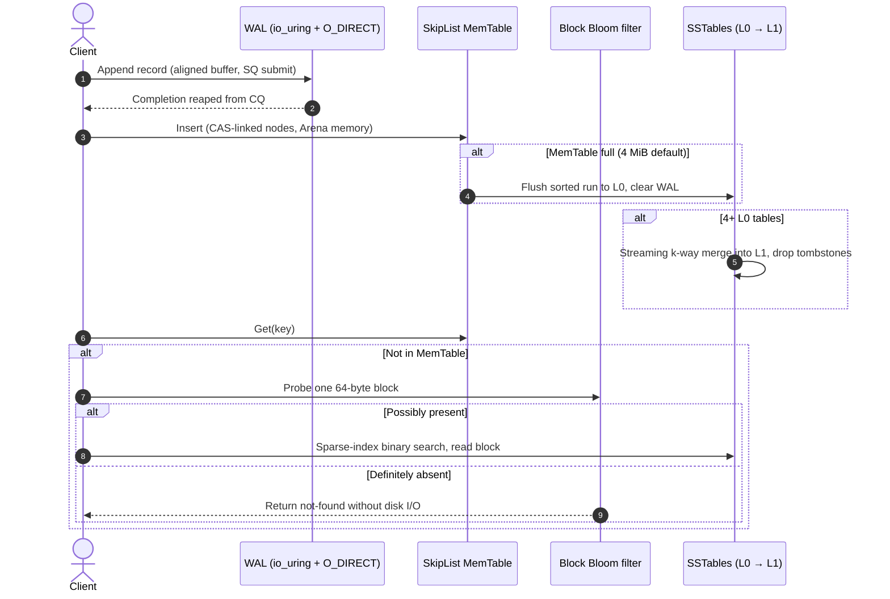

# LSM-Tree Storage Engine

A C++17 log-structured merge-tree key-value engine for Linux: an `io_uring` + `O_DIRECT` write-ahead log, a lock-free SkipList MemTable, cache-line-aligned Block Bloom filters, and leveled compaction.

[](https://en.cppreference.com/w/cpp/17)
[](https://kernel.dk/io_uring.pdf)
[](.github/workflows)
[](LICENSE)

| | |
|---|---|
| **Write path** | 254,095 writes/sec, 3.85 µs avg, 32.21 µs P99 (`io_uring` + `O_DIRECT`, not fsynced per record) |
| **Read path** | 189,263 reads/sec on Bloom hits; 1,315,789 reads/sec on Bloom misses (0.76 µs avg, no disk access) |
| **Tests** | 8 test programs: SkipList (incl. invariants), Bloom filter, WAL ordering and crash recovery, SSTable, block cache, streaming compaction |
| **Built by** | Started by [@harsharajkumar-273](https://github.com/harsharajkumar-273); developed with contributors during ELUSOC 2026 (see [Credits](#credits)) |

All numbers come from [`benchmarks/results.md`](benchmarks/results.md) and can be reproduced with `./run_all.sh`.

---

## How it works

**Write path.** Every `PUT`/`DELETE` is appended to the WAL, then inserted into the MemTable.

- The WAL file is opened with `O_DIRECT`, so writes skip the page cache. Buffers are 512-byte aligned (`posix_memalign`) as `O_DIRECT` requires.
- Appends are submitted through an `io_uring` submission queue and reaped from the completion queue, so callers don't block on each write. A mutex serializes submission so log order matches write order.
- The MemTable is a SkipList with atomic forward pointers. Inserts link nodes with compare-and-swap, so traversals never take a lock. Nodes come from a bump-pointer `Arena` in 1 MB chunks.

**Flush and compaction.** When the MemTable passes its size limit (4 MiB by default) it is flushed to a sorted Level-0 SSTable and the WAL is cleared. Once there are 4 L0 tables, leveled compaction merges them into non-overlapping L1 tables with a streaming k-way merge (bounded memory) and drops tombstones.

**Read path.** Lookups check the MemTable, then L0 tables newest-first, then the one L1 table whose key range matches. Before touching disk, each SSTable's Block Bloom filter is probed. The filter maps every key to a single 64-byte block, so a probe costs at most one cache-line miss and absent keys never reach disk.

**Recovery.** On restart the engine replays the WAL, checks each record's CRC32, skips corrupted records, and rebuilds the MemTable.



Deeper design notes: [`ARCHITECTURE.md`](ARCHITECTURE.md).

---

## Benchmarks

Recorded in a privileged Docker container (Ubuntu 22.04, kernel 6.12, NVMe SSD). Full output: [`benchmarks/results.md`](benchmarks/results.md).

| Operation | Setup | Throughput | Avg | P99 |
|---|---|---|---|---|
| Sequential write | `io_uring` + `O_DIRECT` | 254,095 ops/s | 3.85 µs | 32.21 µs |
| Sequential write | `write` + `fdatasync` per record | 2,525 ops/s | 395.75 µs | 1,115.92 µs |
| Point read, Bloom hit | sparse index + block read | 189,263 ops/s | 5.23 µs | 13.50 µs |
| Point read, Bloom miss | answered in memory | 1,315,789 ops/s | 0.76 µs | 2.20 µs |

**Read these carefully.** The two write rows sit at different durability points. The `fdatasync` arm is on stable storage before each call returns. The `io_uring` arm reaches the device through `O_DIRECT` but is not forced to stable storage per record. So the gap between them measures the interface *and* the durability guarantee together, and it is not a like-for-like speedup. [`bench_write.cpp`](benchmarks/bench_write.cpp) also runs a third arm (buffered `write`, no sync) as a floor, and prints this caveat with its results.

```bash
./run_all.sh   # unit tests, then bench_write and bench_read
```

---

## Quick start

```bash
git clone https://github.com/harsharajkumar-273/lsm_tree.git
cd lsm_tree

# Build and run tests + benchmarks in Docker (io_uring needs --privileged)
docker build -t lsm-engine .
docker run --rm --privileged lsm-engine

# Or build natively (Linux 5.1+, liburing)
mkdir -p build && cd build && cmake .. && make -j"$(nproc)"
./test_skip_list && ./test_bloom_filter && ./test_wal_recovery
```

An interactive shell is in [`tools/lsm_cli.cpp`](tools/lsm_cli.cpp).

---

## Limitations

- Single-node, single-process engine. No replication or snapshots.
- Two levels (L0 → L1) only.
- The `io_uring` write path is not forced to stable storage per record, so a power failure can lose recently acknowledged writes. See the benchmark note above.
- Benchmarks were recorded on one machine. Your numbers will differ.

---

## Credits

This engine was built in the open during the ELUSOC 2026 open-source program. [@harsharajkumar-273](https://github.com/harsharajkumar-273) started it and maintains it: architecture, issue triage, design review, and merging. Much of the current WAL, compaction, and test code comes from contributors:

- [@SakethSumanBathini](https://github.com/SakethSumanBathini): WAL write ordering and offsets, fsync and write-failure handling, SkipList invariant tests, bounds and overflow fixes
- [@Myparadox-creator](https://github.com/Myparadox-creator) (Aditya R. Satapathy): streaming k-way compaction with a priority-queue merge ([#100](https://github.com/harsharajkumar-273/lsm_tree/pull/100)), LRU block cache, and their tests
- [@rohitkumarnaidu](https://github.com/rohitkumarnaidu) (Bappadala Rohith Kumar Naidu): features and fixes from the issue tracker

See the [merged pull requests](https://github.com/harsharajkumar-273/lsm_tree/pulls?q=is%3Apr+is%3Amerged) for the full history.

## License

MIT. See [`LICENSE`](LICENSE).
